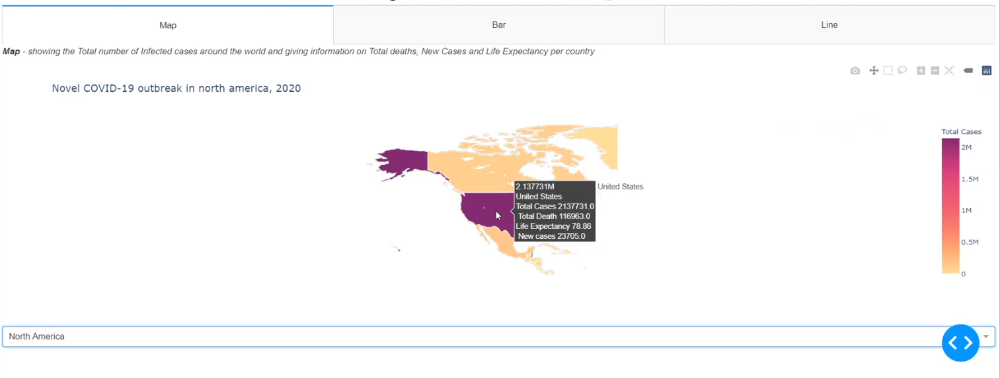

This visualization project was aimed for health care sector researchers from various country as well as
organizations, such as, Health Services Sector, International Labor Organization. The objective of
our task is to visualize COVID-19 data in a way that will assist them to comprehend the impact of
a pandemic situation on current health service and the probable improvement measures that
should be taken by the concerned authority.

**User Interaction Flow** 
* The home-screen of our project plots the choropleth map illustrating total infected cases where
color densities vary with number of cases. There are three tabs for the user to change whether
they want to get visualization for the world map or they want to move to the bar chart plotting or
they can also switch to the line graph visualization tab. When hovering over the map it will show
the user country-wise information such as, total infected cases, total death cases, life expectancy
and new cases. 

* The user can also get same visualized information continent wise by selecting the
specific continent from the dropdown menu.

* Upon clicking on the bar chart tab, it will provide the user with a comparison stacked bar chart
of 37 countries with respect to COVID-19 recovered cases, total population and health support
factor. The health support factor is a factor calculated from the total number of hospital beds,
number of doctors and number of nurses of a particular country. It indicates how well a country
can support each citizen with health services. To calculate the factor, first these three values are
calculated for each person by dividing with 1000 as the original data is given for per thousand
people. After that, summation of these three values is taken as a measure to indicate health
support system of a country.

* The user can also get a visualization of total infected COVID-19 cases and death cases as a line
graph country wise. To make the line graph appear on the screen, the user need to select the
continent first from the ‘Continent’ drop down menu and then depending on the selected
continent, countries belonging to that continent can be selected from another dropdown menu
‘Country’. The line graph will then illustrate the gradual increase of total infected case and total
death case of that country starting from December 31,2019 to June 17,2020.

**Visualization Techniques** 
1. Geo visualization technique (Visual variable: color)
2. Line based techniques
3. Region based techniques

**Interaction Operators**
* Navigation : zoom in , zoom out (Interaction Operand: Screen space)
* Selection (selection by click): (Interaction Operand : Screen space)
* Reconfiguration (change scaling on axis of bar chart to get a better data point
visualization, switching Excel table columns): ( Interaction Operand : Screen
space)
* Selection (bar chart selection by click): (Interaction Operand: Data value space
and visualization structure space)

**Connection operator**
* Linking (Data for selected countries is plotted on a different view, a line graph)